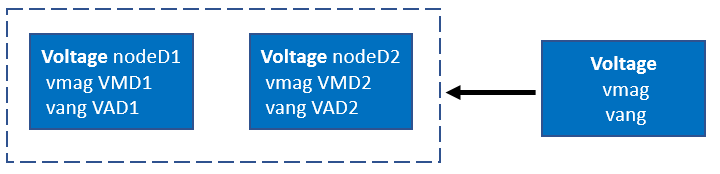
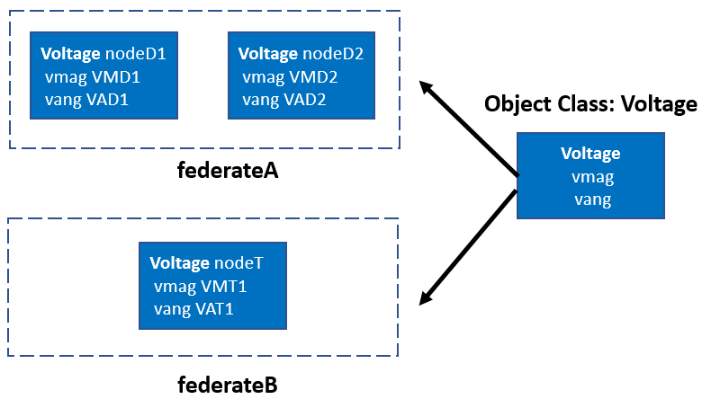
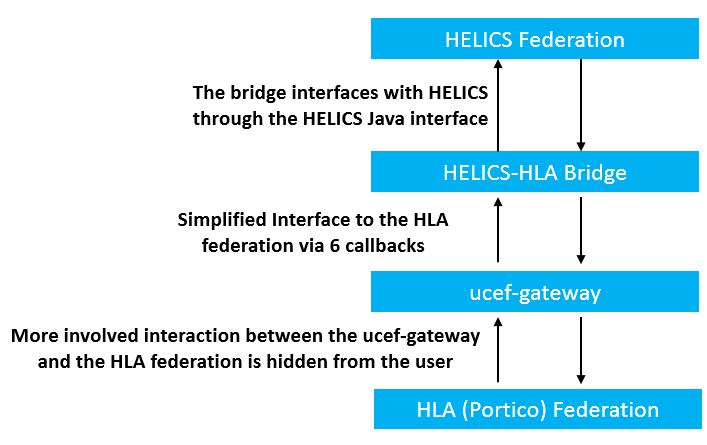
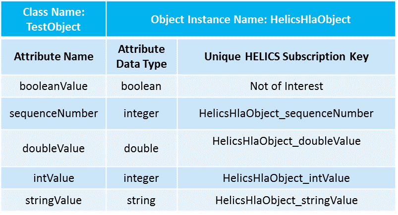
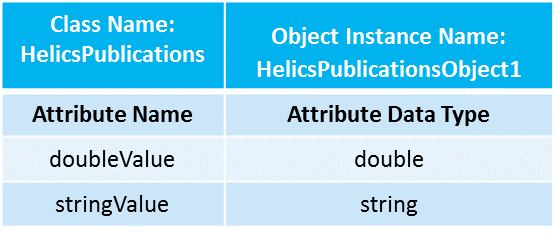
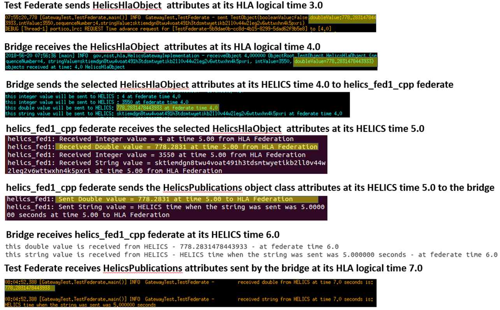

# HELICS-HLA (Portico) Co-Simulation Prototype Bridge

This document describes how a Portico federation [1], which is based on the High Level Architecture (HLA) and designed using the Universal CPS Environment for Federation (UCEF), can be interfaced with a co-simulation federation developed using the Hierarchical Engine for Large-scale Infrastructure Co-Simulation (HELICS). This document focuses on:

- Building HELICS in the UCEF virtual machine
- Explaining the key concepts of the bridge developed to interface a Portico RTI-based HLA federation (in this document we are exclusively concerned with Portico RTI-based HLA federations. Any mention of a HLA federation in this document should be understood to mean a Portico RTI-based HLA federation) with a HELICS federation
- Demonstrating by a simple example the ability of the HELICS-HLA prototype bridge (hereafter referred to as the HELICS-HLA bridge or just the bridge) to co-simulate the HELICS and HLA federations

## A. Building HELICS on the UCEF Virtual Machine

The Portico federation designed using UCEF works inside a virtual machine. To build HELICS on the UCEF Virtual machine (Ubuntu 14 is the OS on this machine), the Ubuntu installation instructions of HELICS (https://github.com/GMLC-TDC/HELICS-src) may not work as those instructions are for Ubuntu 16 or newer, which come with new:

- C++ and C compilers (default on Ubuntu 16 seems to be gcc 5.1.3)
- CMake version

So, the following modified steps can be followed to build HELICS on the UCEF virtual machine.

1. Upgrade the version of CMake using the following steps:

   (i). Uninstall previous versions of CMake using `sudo apt-get purge cmake`. Once this command is run, you may be prompted to remove `cmake-data` package. Follow the suggested instructions to remove this package as well.

   (ii). Next, get the source files of CMake version 3.8.2 from `https://cmake.org/files/v3.8/` . Note that the source version is the `.tar.gz` file without the machine architecture number. E.g., `cmake-3.8.2.tar.gz`, which can be downloaded using:

```bash
wget https://cmake.org/files/v3.8/cmake-3.8.2.tar.gz
```

   (iii). Now, unzip the tar file using `tar -xzvf cmake-3.8.2.tar.gz`

   (iv). Next, change the directory to the CMake directory formed after unzipping the tar file, and run `env CC=clang CXX=clang++ ./bootstrap`. The environment variables for the C and C++ compilers must be changed to `clang` to ensure that CMake is built with clang, and not with the default gcc compiler available in Ubuntu 14.

   (v). Next, run `make`, followed by `sudo make install`.

   (vi). Cmake should now be installed, and running `cmake –version` should display cmake version 3.8.2. (or the version that you installed).

2. Install clang 3.5. This is likely the highest version of clang that can be installed on Ubuntu 14. Following the installation, do the following:

    (i). Point C and C++ compiler variables to the clang 3.5 C and C++ compilers, respectively.

```
sudo update-alternatives --install /usr/bin/cc cc /usr/bin/clang-3.5 100
sudo update-alternatives --install /usr/bin/c++ c++ /usr/bin/clang++-3.5 100
```

    (ii). Create an alias for clang-3.5 C compiler such that it is pointed to by clang; same for the C++ compiler.

```
sudo ln -s /usr/bin/clang-3.5 /usr/bin/clang
sudo ln -s /usr/bin/clang++-3.5 /usr/bin/clang++
```

    (iii). For CMake to use the clang 3.5 compilers when building HELICS, add the paths of the clang C and C++ compilers to variables CC and CXX.

```
export CC=/usr/bin/clang
export CXX=/usr/bin/clang++
```

3. Build Boost 1.65.1 libraries with clang using the following instructions:

    (i). Download boost 1.65.1 using this command: `wget -O boost_1_65_1.tar.gz https://sourceforge.net/projects/boost/files/boost/1.65.1/boost_1_65_1.tar.gz/download`. Higher versions of boost can also be used.

    (ii). Unzip the downloaded file using `tar xzvf boost_1_65_1.tar.gz`.

    (iii). Go to the folder with the extracted boost source files, and run:

```
./bootstrap.sh --prefix=/home/vagrant/local/ --with-toolset=clang
```

    By specifying the toolset as clang, bootstrap is forced to use the clang compiler instead of the default gcc compiler.

    (iv). Run `./b2 toolset=clang cxxflags="-stdlib=libc++" linkflags="-stdlib=libc++"` to build the boost libraries with clang and by using the `libc++` library.

4. Install zmq3 using `sudo apt-get install libzmq3-dev`.

5. Install HELICS using the following statement instead of the CMake command given in the instructions on the HELICS repository:
`cmake -DBOOST_ROOT:PATHNAME="home/vagrant/boost_1_65_1" -DUSE_LIBCXX=ON -DBUILD_HELICS_EXAMPLES=ON -DBUILD_JAVA_INTERFACE=ON ../`.
This command tells CMake to use the libc++ library, build the java interface, and the HELICS examples.

6. Finally, run `sudo make` and `sudo make install` one after the other to complete the build process.

## B. HELICS-HLA Integration

### a. Key Concepts

To understand the approach used for integrating HELICS with HLA, it is important to understand how object classes and value federates work in HLA and HELICS, respectively. The discussion that follows describes the key concepts and the approach adopted for integrating HELICS with HLA.

#### HLA - Object Classes in HLA work as follows:

1. Each federate that publishes/subscribes to an object class, can publish multiple instances of the class.
   e.g., as shown in figure 1, if there is an object class voltage for a federate (`federateA`), with attributes voltage magnitude (`vmag`) and voltage angle (`vang`), then the federate can publish two instances of the same class (instance names are `nodeD1` and `nodeD2`) with different object instance names.


    

    Fig. 1: HLA federate `federateA` publishes two instances of the `Voltage` object class

2. Multiple federates can also publish values to the same object class.
   e.g., Federate `federateB` can also publish the voltage class (instance name `nodeT`).

    

     Fig. 2: Both HLA federates `federateA` and `federateB` publish an instance each of the `Voltage` object class

3. Object instance names are unique across the HLA federation. We can either explicitly specify the object instance names at the time of registering the object instances, or let the RTI assign unique names.

#### HELICS - Value Federates in HELICS work as follows:

1. Federate names are unique in the HELICS federation

2. Each federate publishes/subscribes to one or more publications/subscriptions that are uniquely identified in the HELICS federation by their key name. The key name can either be a globally unique name, or a combination of <federate name> + <separator (that we can choose)> + <name>.
e.g., HELICS may have a federate `federateC` that subscribes to HLA `federateA` voltage magnitudes contained in objects `nodeD1` and `nodeD2`. So, the unique subscription key names can be `federateC_nodeD1` and `federateC_nodeD2`.

### b. HELICS-HLA Co-simulation Architecture and Approach

Based on the above discussion regarding the nature of publications and subscription in HLA and HELICS value federates, we adopted the following approach to enable the co-simulation of the two federations.

#### Assumptions

- Object instance names are known apriori. These can be decided at the time of developing the federation agreement. E.g., `nodeD1` and `nodeD2` above.

- The HLA object class instances and their attributes that HELICS wishes to subscribe are known apriori. This can also be included in the federation agreement. E.g., `federateC` in HELICS is interested in subscribing to the `vmag` attribute of object instances `nodeD1` and `nodeD2`. The datatypes of the attributes are also known. These datatypes must be identical to the corresponding HELICS subscriptions datatypes.

- The HELICS publications that the HLA federation wants to subscribe to are known apriori along with their datatypes. This can also be included in the federation agreement. E.g., `federateB` in HELICS will publish the voltage magnitude and angles `vmag` and `vang`.

- Any HLA federate that is interested in HELICS subscriptions will be modified so that it can subscribe to the HELICS publications. WebGME [2] can be used to automatically generate the code for the HLA federate.

#### HELICS-HLA Bridge

Based on the above assumptions, we wrote a prototype “bridge” code to connect and co-simulate the two federations. The code is not intended to be directly adaptable to any HELICS-HLA co-simulation. Instead, the objective of developing this code is to implement and test the concepts that are required to perform HELICS-HLA co-simulations, so that it can be leveraged in the future to perform more complex co-simulations using the two co-simulation platforms.

The HELICS-HLA bridge essentially acts as a dual federate, i.e., it is both an HLA and a HELICS federate. This enables the bridge to connect, synchronize, and facilitate the exchange of data between the two co-simulation federations. All the data that is to be exchanged between the two federations is routed through the bridge. Figure 3 shows the architecture of the bridge.

As shown in figure 3, the connection of the HELICS-HLA bridge to the HLA federation is facilitated by the ucef-gateway federate, which is an HLA federate that has been developed by the National Institute of Standards and Technology (NIST) to simplify the integration of any simulator or a piece of code with a Portico RTI-based HLA federation [3]. ucef-gateway provides access to six callbacks, which should be implemented by a simulator to connect with the underlying HLA federation. The bridge implements these callbacks, except for the `receiveInteractions()` callback, thereby enabling the simulator (HELICS federation) to connect with the HLA federation. The bridge interfaces with a HELICS federation through the HELICS java interface. The `receiveInteractions()` callback has not yet been found to be relevant for the HELICS-HLA bridge. However, it might be useful for specific applications of the bridge in the future. Nonetheless, this callback must be implemented (even if it does nothing) for the ucef-gateway federate to work.

The key features of the bridge code are explained next. The explanation of the features is tied to the example we developed to demonstrate the ability of the bridge code to co-simulate the two federations.



Fig. 3: Architecture of the HELICS-HLA Bridge (Block diagram, except the blue text boxes, is from this paper, which introduced the ucef-gateway - `T. Roth and M. Burns, "A gateway to easily integrate simulation platforms for co-simulation of cyber-physical systems," 2018 Workshop on Modeling and Simulation of Cyber-Physical Energy Systems (MSCPES), Porto, Portugal, 2018, pp. 1-6.`)

**1.Creating the `HelicsPublications` Object Class**

The `HelicsPublications` object class acts as the container for all the HELICS publications that are of interest to the HLA federation. Its attribute names must be identical to the HELICS value federate publications key names in the HELICS federation. Since this class is only published by the HELICS-HLA bridge, a unique object instance name for this class is not required although it can be provided if desired.  This class must be included in the SOMs of all the HLA federates that wish to receive the HELICS federation publications.
The java code for this object class can be automatically generated using WebGME. This class should also be defined in the simulation object model (SOM) of the HELICS-HLA bridge, and in the federation object model (FOM) of the federation of which the HELICS-HLA bridge is a part.

**2.Create HELICS publications and subscriptions in HELICS federation federates**

The HELICS federation publications and subscriptions that will directly participate in the HELICS-HLA co-simulations (likely to be a small fraction of the total HELICS federation publications and subscriptions) must be registered with unique keys in the HELICS federates such that a one-to-one mapping can be created between the HELICS publications and subscriptions in the HELICS federates and the HELICS subscriptions and publications in the HELICS-HLA bridge.
This is done by creating the publication and subscription keys as Portico object instance name + attribute name pairs. e.g., continuing from the example discussed earlier, HELICS subscriptions should be named `nodeD1_vmag` and `nodeD2_vmag`. As was explained earlier, the uniqueness of the HLA object instance names will ensure that these HELICS subscriptions will be unique in the HLA federation. The uniqueness of these keys in the HELICS federation must be ensured. The apriori determination and agreement on the object instance and attribute names as discussed under `Assumptions` above will prevent such duplication.
The HELICS publications for the Portico federation, or HLA subscriptions from HELICS, should also be created. The keys for these HELICS publications should be identical to the HelicsPublications object class attribute names as discussed in point 1 above.

**3.Create HELICS publications and subscriptions in the HELICS-HLA bridge**

In the HELICS-HLA bridge, the HELICS federation publications that are participating in the HELICS-HLA co-simulations become the HELICS subscriptions with identical keys, types, and units. Similarly, the HELICS federation subscriptions become the HELICS publications in the HELICS-HLA bridge.

**4. Encoding/Decoding publications and subscriptions between HLA and HELICS.**

   For sending data from HLA to HELICS: The HELICS-HLA bridge will receive data from the HLA federation at multiple times during a timestep. Each object instance may be updated multiple times, and many federates may update their object Instances at each time step in the HLA federation. We assume in the bridge that only the latest values are of interest. To ensure that only the desired attributes from desired object instances are passed onto HELICS, and previous values are passed if no object attribute updates occur in the HLA federation at a time step, we use a hash map which has as many keys as the number of HLA subscriptions that the HELICS federation is interested in. At each `receiveObject()` callback that is received by the HELICS-HLA bridge from the ucef-gateway federate, HELICS subscriptions keys are compared with the string formed as `<object instance> <_> <attribute>` , and the value of the appropriate key in the hash map is updated when a match occurs.

The HELICS subscriptions are sent to HELICS from the bridge through the `doTimeStep()` callback of the gateway federate. This callback is sent out by the ucef-gateway federate once per HLA federation time step, thereby providing the ability to synchronize the HLA and HELICS federations. Inside the `doTimeStep()` callback, a `UCEFToHelicsTimeRequest()` function is called to both synchronize the HLA and HELICS federations and to send the HLA publications to HELICS. This is done by:

(i) HLA and HELICS federations are synchronized by passing the current HLA federation time to the `UCEFToHelicsTimeRequest()` function and waiting in a while loop till the HELICS federation time equals the HLA federation time.

(ii) Looping through each hash map key and publishing the values to HELICS. Since the ucef-gateway federate converts all the attribute values received from the HLA federation into strings before they are passed to the `receiveObject()` callback, appropriate conversion of the strings to the HELICS publications datatypes is performed. Since the HELICS subscriptions datatypes are known apriori as discussed in the `Assumptions` above, the conversion process is automated (using a set of `if-else` statements).

For receiving data from HELICS: For HELICS federation publications that are to be sent to the HLA federation, we first create an object instance of the `HelicsPublications` class inside the `initializeWithPeers()` ucef-gateway federate callback function during the initialization phase. A separate hash map is prepared, where depending on the HELICS publications datatype, appropriate conversion to string is performed so that the HELICS publications values can be sent to the HLA federation through the gateway federate. Since the `Assumptions` above ensure that the HELICS publications keys and the corresponding datatypes match with the attributes and datatypes of the `HelicsPublications` object class, the conversion of HELICS published values to string is automated using the `if-else` statements.

The `HelicsPublications` object class attributes are updated at each timestep following the synchronization of the HELICS and HLA federations. The updated attributes are sent to the HLA federation from inside the `doTimeStep()` callback using the ucef-gateway federate’s `doObjectUpdate()` function.

## C. Example to demonstrate the functioning of HELICS-HLA Bridge

The features of the HELICS-HLA prototype bridge discussed above were implemented in Java using the ucef-gateway federate’s `test-federation` example as the starting point. The `test-federation` is a 3 federate HLA federation. One of the three federates is the ucef-gateway federate, whose callbacks are implemented in the Java class - `GatewayImplementation.java`, thereby allowing a simulator to interface with the `test-federation`. The simulator in the `modified test-federation` used to demonstrate the interfacing of HELICS and HLA via the bridge is the HELICS federation (single C++ federate HELICS federation in this example). The HELICS-HLA bridge in the `modified test-federation` is implemented by significantly modifying and expanding the `GatewayImplementation.java` class. The resulting class is renamed as `HelicsGatewayImplementation.java`.   The steps for installing the ucef-gateway federate and running the example are discussed next. Discussion of the results generated by the HELICS-HLA integration example is also provided.

### Steps for installing the ucef-gateway repository

The ucef-gateway project is installed inside the UCEF virtual machine. UCEF is a co-simulation platform that enables cyber-physical co-simulations. To install the ucef-gateway inside the UCEF virtual machine, and ensure that it can find the files needed for interfacing with HELICS, the following steps should be followed. NIST helped in the development of these steps.

1. Download and install the UCEF virtual machine from here https://github.com/usnistgov/ucef/tree/develop/build
2. Once inside the virtual machine, go to https://github.com/usnistgov/ucef-core.git  and clone the ucef-core repository. Build the project based on the instructions in this repository. Stay on its `develop` branch.
3. Clone the `ucef-gateway` repository from https://github.com/usnistgov/ucef-gateway.git , and switch to the `feature/refactor` branch. DO NOT be on any other branch.

### Steps to link the modified test-federation with HELICS and run the HELICS-HLA co-simulation

1. Go to `ucef-gateway/test-federation/ExampleGateway`

2. Create the maven directory structure for HELICS

    (i). `cd ucef-gateway/test-federation/ExampleGateway`
    (ii). `mkdir -p src/main/java/com/java/helics`
    (iii). `mkdir src/main/resources`

3. copy the HELICS files into the example gateway

    (i). `cp HELICS-src/build/swig/java/*.java ucef-gateway/test-federation/ExampleGateway/src/main/java/com/java/helics/`
    (ii). `cp HELICS-src/build/swig/java/libJNIhelics.so ucef-gateway/test-federation/ExampleGateway/src/main/resources/`

4. integrate HELICS into the example gateway

    (i) copy the `HelicsGatewayImplementation.java` class file from the `HELICS-HLA` repository and paste it here: `/ucef-gateway/test-federation/ExampleGateway/src/main/java/gov/nist/hla`. At the minimum the following import statement should be added at the beginning of the HELICS-HLA bridge code  - `import com.java.helics.helics;`. More such import statements may be needed depending on the HELICS functionalities required in the HELICS-HLA bridge. Similarly `System.loadLibrary(“JNIhelics”)` must be added in the `main()` function of the HELICS-HLA bridge. It is already included in the `HelicsGatewayImplementation.java` file, which is the HELICS-HLA bridge for the `modified test federation` example.

    (ii) Copy the `HelicsGatewayImplementation.json` and `HelicsHLAGateway.xml` files from the `HELICS-HLA` repository (located inside the `ConfigurationFiles` folder) and paste here: ` ucef-gateway/test-federation/ExampleGateway/conf/`. The `HelicsHLAGateway.xml` is the SOM for the ucef-gateway federate and the `HelicsPublications` object class is included in this file along with its attributes. The SOM is referenced in the `HelicsGatewayImplementation.json` file. Other configuration parameters such as the time step of the ucef-gateway federate are also specified in the json file.

    (iii) The second federate of the test federation is called the `TestFederate`. This federate exchanges data with the HELICS federation. Therefore, its SOM should also contain the `HelicsPublications` class. The `GatewayTest.xml` is the SOM for the `TestFederate` federate, which is modified to include the `HelicsPublications` object class. The modified SOM is available in the `HELICS-HLA` repository inside the `ConfigurationFiles` folder. It should be copied and pasted here by replacing the original SOM: `ucef-gateway/test-federation/GatewayTest_deployment/fom/GatewayTest.xml`.

    (iv) The code of the `TestFederate` federate was itself modified. The name of the object instance through which HELICS will recognize its publications was specified as part of the modifications. Additional modifications can be identified by comparing the new `TestFederate.java` file with the original file that is downloaded as part of the ucef-gateway repository. The modified ` TestFederate.java` file is located inside the `HELICS-HLA` repository. It should be pasted here: `/home/vagrant/ucef-gateway/test-federation/GatewayTest_generated/GatewayTest-java-federates/GatewayTest-impl-java/TestFederate/src/main/java/GatewayTest`.

    (v) The test federation’s FOM should also be modified to add the `HelicsPublications` class. This FOM has the extension of `.fed` in the Portico RTI-based HLA federations. To run the `modified test federation`, replace the federation’s FOM titled `GatewayTest.fed` with the modified `GatewayTest.fed` file located in the HELICS-HLA repository inside the `ConfigurationFiles` folder. The path of the `GatewayTest.fed` file is: `ucef-gateway/test-federation/GatewayTest_deployment/fom`.

    (vi) For each object class that participates in the HLA federation, a java class by the same name must be generated. For Portico HLA federations, this can be done using WebGME. NIST generated the java class for the `HelicsPublications` class, which is located in the `HELICS-HLA` repository and should be pasted here: `ucef-gateway/test-federation/GatewayTest_generated/GatewayTest-java-federates/GatewayTest-rti-java/src/main/java/GatewayTest`. Similarly, NIST also generated the modified `TestFederateBase.java` file, which is required to run the modified test federation example. This file is also located in the `HELICS-HLA` repository and must be pasted here: `/home/vagrant/ucef-gateway/test-federation/GatewayTest_generated/GatewayTest-java-federates/GatewayTest-base-java/src/main/java/GatewayTest`.

    (vii) To run the `test federation` example, the `run.sh` file should be executed. This file is also modified to execute the `modified test federation`. The modified `run.sh` file should be copied from the `HELICS-HLA` repository and pasted here: `ucef-gateway/test-federation`.

    (viii) Replace the existing `experimentConfig.json` file located here `ucef-gateway/test-federation/GatewayTest_deployment/conf/experimentConfig.json` with the `experimentConfig.json` file located inside the `ConfigurationFiles` folder of the `HELICS-HLA` repository. The federate types that an HLA federation expects are specified in the `experimentConfig.json` file, and these types should match the federate types specified in the individual federates’ json files. In the `experimentConfig.json` file located in the `ConfigurationFiles` folder of the `HELICS-HLA` repository file, `Gateway` federate type is changed to `HelicsHLAGateway`, because this is the federate type or ID for the `HelicsGatewayImplementation` class in the `modified test federation` example. `HelicsHLAGateway` is specified as the value of the `FederateName` parameter in the `HelicsGatewayImplementation.json` file.

5. HELICS single C++ Federate Federation

    Copy the `helics_fed1.cpp` file from the `HELICS-HLA` repository and paste it inside the `examples` folder of the `HELICS-src` repository (` HELICS-src/examples/CppInterface`). Also copy the `CMakeLists.txt` file from the `ConfigurationFiles` folder of the `HELICS-HLA` repository to the `HELICS-src/examples/CppInterface` folder.

6. Run the modified test federation

    First build the HELICS federation by opening a command prompt, going to ` HELICS-src/build/examples/CppInterface` and executing the `make` command to build the `helics_fed1` example . Next, build the `modified test-federation` by executing `. build.sh` from here :` ucef-gateway/test-federation`.

    Once the HELICS and HLA (Portico) federations are built, execute `./helics_fed1_cpp`. This will start the HELICS federation. Next, start the test federation by executing `. run.sh` from here: ` ucef-gateway/test-federation`.

### Discussion of Example Results

The modified test federation simulation involves sending some object class attributes from the `TestFederate` federate of the HLA federation, routing some of them via the HELICS-HLA bridge to the single federate HELICS federation, and finally, sending some data from the HELICS federation via the HELICS-HLA bridge back to the `TestFederate` using the `HelicsPublications` object class. Although simple, the example tests the key features of the HELICS-HLA bridge that are required to synchronize any HLA and HELICS federations, and correctly route the desired publications and subscriptions.

Figure 4 shows the HLA publications for HELICS. The publications are published by the object instance of class `TestObject` named `HelicsHlaObject`. `HelicsHlaObject` publishes five attributes that are shown in figure 4 along with their data types. Of the five attributes, the HELICS federation in this example is interested in only four attributes that are shown in figure 4. Also shown in figure 4 are the unique HELICS federation subscription keys based on the rules discussed in this document earlier (each key is a combination of object instance name and the attribute name).



Fig. 4: Publications of the `TestObject` class published by the `TestFederate` HLA federate and attributes of interest to the HELICS federation

Figure 5 shows the HELICS publications by the `helics_fed1` C++ federate that are of interest to the `TestFederate` HLA federate. These are the attributes of the `HelicsPublications` class, an instance of which is published by the HELICS-HLA bridge. The name of this instance is ` HelicsPublicationsObject1`. The `doubleValue` publication of the `helics_fed1` federate contains the same value that it receives in the `HelicsHlaObject_doubleValue` subscription from the HLA federation via the bridge.



Fig. 5: HELICS federation publications subscribed by the `TestFederate` federate of the HLA Federation

Figure 6 shows one complete sequence of the simulation. It shows that the two federations have synchronized and are exchanging the data as expected. Each time the modified test federation is run, the double values received by the HELICS federation will be different from the ones seen in figure 6 because these are generated randomly in the `TestFederate`.



Fig. 6: One complete sequence of data exchange between the HELICS and HLA federations in the `modified test federation` example.

## D. References

[1]. https://github.com/openlvc/portico

[2]. https://webgme.org/

[3]. https://github.com/usnistgov/ucef-gateway

